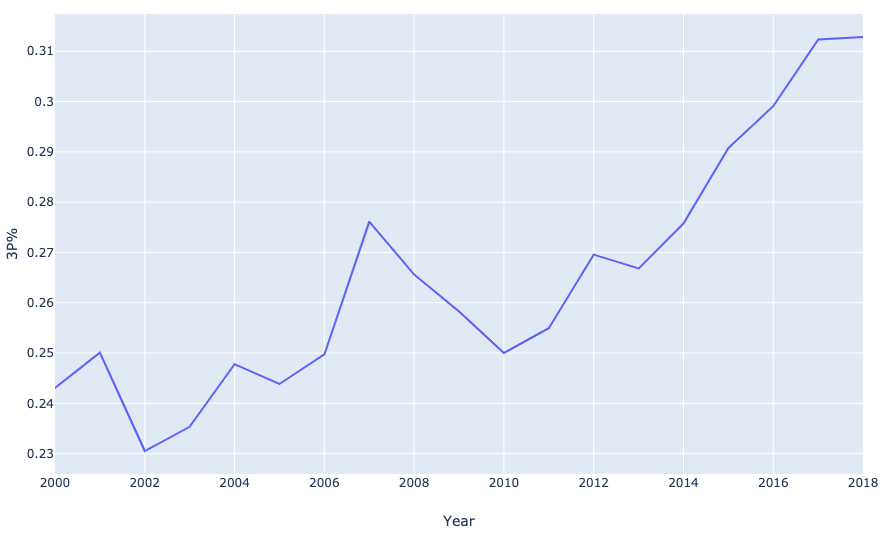
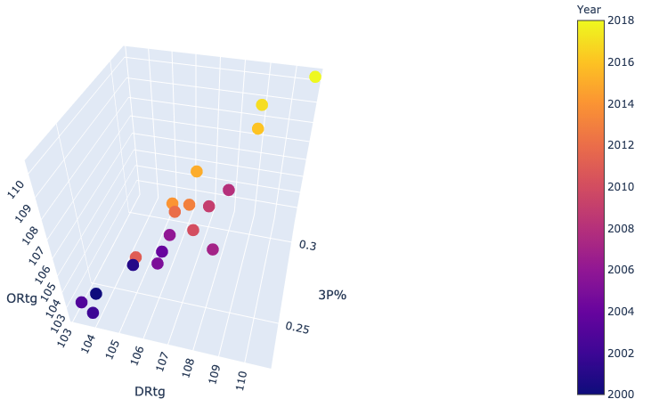
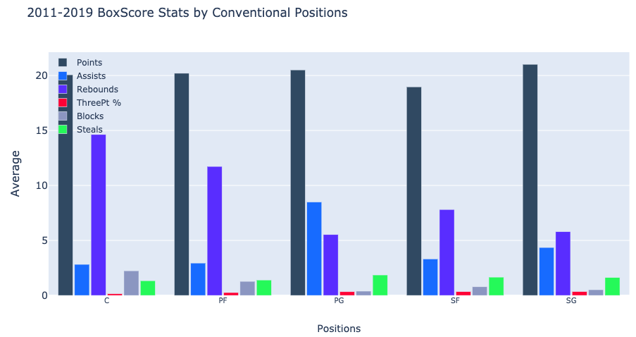
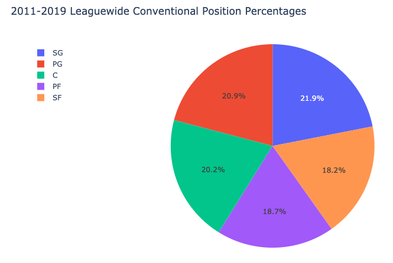
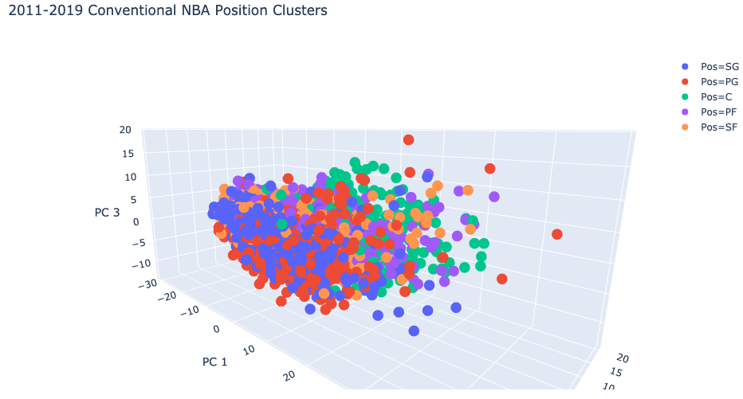
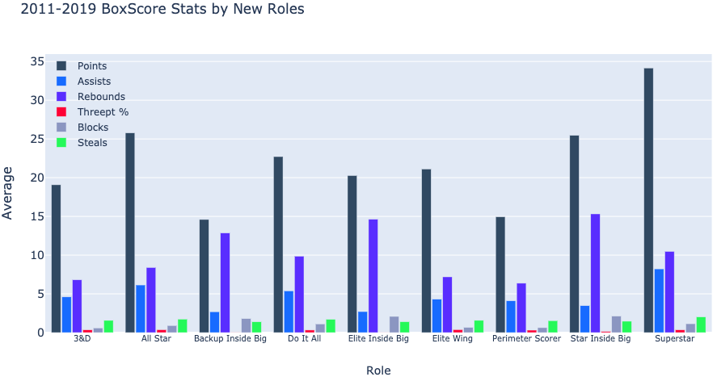
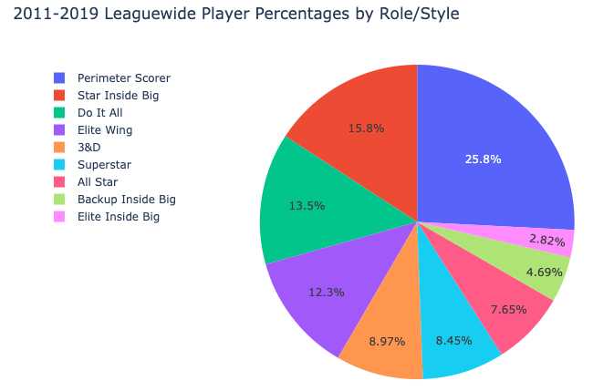
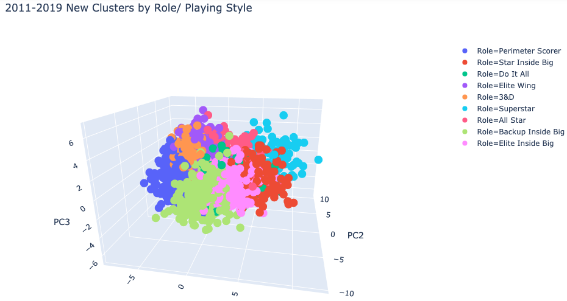
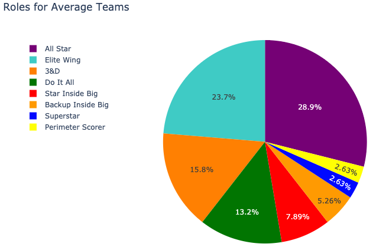
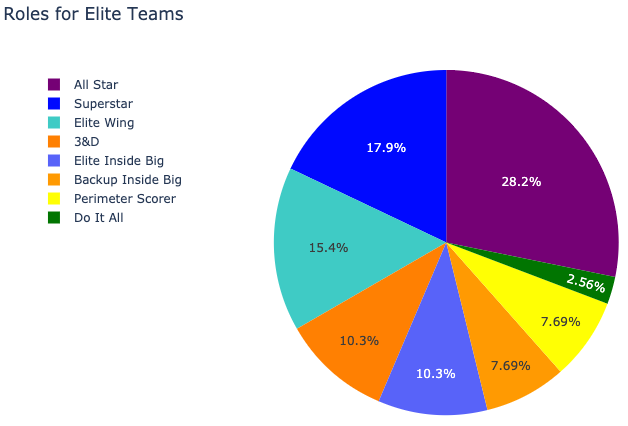

# Using K-means clustering Algorithm to Redefine NBA positions and Exploring Roster Construction
### Project Description and Motivation 
Conventional positions within the NBA do not accurately reflect the playing style or functional role a player provides to their team. The overall style of play has changed drastically and various era’s within the NBA indicate that. Similarly a players style of play is also reflective of this change. Currently the league is fast paced and with more floor spacing. An example that demonstrates this are Centers who shoot 3's and stretch the floor for their teams. These centers that are multi-faceted are still grouped with traditional Centers and there is no methodology to distinguish between the two. The purpose of this project is find a better approach to define these players roles based on the value they bring to their team.   

## **Data Source** 
Information was scraped from Basketball-Reference and statistics for every player from 2011 to 2018 were collected. 2011 was used as the initial start year because it reflective of when positionless basketball started to take form (LeBron being the main facilitator in Miami and the start of the Golden State Dynasty). Approximatley 3000 observations were included in the final dataset. 
In total there were 30 features describing each player. Features include box-score metrics such as Points, Rebounds, Blocks, Steals. Advanced metrics were also used. Some examples include : USG%, PER, and Plus-Minus Score. 
All features were defined by a Per-100 possessions unit. This was done to ensure that players statistics were comparable regardless of how many minutes or games they played. 
Players who did not play more than 400 minutes were excluded because they do not have significant impact on the game.   

## **Exploratory Data Analysis**

#### Graph displaying League Average for 3 Pt % over time

#### Graph displaying League Average for various features (Ortg, Drtg, 3P%) over time

The two graphs are examples focusing on certain features and indicate an upward trend over time. These features include 3 pointers made, and other metrics demonstrating efficiency and overall offense. This change from a league wide perspective indicates that player role/style has also changed as the seasons evolved.  

#### Graph illustrating Average Stats for Conventional Positions. 

This graph cannot tell us about players that do not fit their conventional roles assigned. For example what about the Power Forwards that are also facilitators? Or Guards that have multi-demensional roles? 

#### Pie chart showing even distribution of conventional positions

#### Clustering visualization of conventional positions

Players assigned to the same conventional position are scattered throughout the graph. Indicating that they do not have similar playing style. (Principal Component Analysis was used to reduce the dimensionality of the 30 features into 3 components). 

## **Data Science Methods used**
* Principal Component Analysis (PCA) was used to reduce demensionality for the visuals. Since there are over 30 features describing each player it is impossible to create visual Clusters with so many features. After utilzing PCA, 90 % of the variation within all the features were still retained. They were simplified to 3 components, hence a 3D model. PCA was used for the visualization of the conventional position clusters and well as for the new roles after implmenting the k means clustering algorithm.    
* K-means clustering is an unsupervised algorithm where no labels are given. The basic idea is that centroids (n) are assigned, which then begins to cluster (group) based off of how close the observation (player) is to that centroid. 
* Elbow method and Silhouette score. In order to figure out how many clusters (new roles) are ideal, the silhoutte score, was utilized. Silhouette score explains the density of each cluster and the seperating from cluster to cluster. The elbow method displays as the number of clusters increass, how much the silhoutte score is changing by. Once the rate slows down significantly picking a higher the number of ;n' clusters isn't very useful. For this project I ended up with 9 clusters total.  
* Scaling features. Since k-means is using a distance metric to evaluate and assign each observation which cluster they belong to, it is very important to scale all of the features. For example, 40 points is not comparable to 2 blocks, they are essentially different units. I also assigned weights to various features to give certain styles more emphasis. For example Assists and Turnovers can be said to represent ball handling so it was assigned a different weight when compared to the other features.  

## *Results after K-Means Clustering*

#### Graph displaying New Roles

#### Pie chart of New Roles

#### Clustering Visual with New Roles Assigned
Labels were assigned to the new 9 clusters by seeing the average stats for each cluster. Then also looking at the players within each cluster. By using domain knowledge and what was revealed within the cluster a labe was generated to describe that cluster. 

The clusters are much more condensed and sorted now when compared the clusters generated for the conventional role. This indicates that the clusters are representative of their playing style/role and provides more insight to teams and fans. 

## **Business Insight Questions**

#### What is the difference between Elite teams  &  Average teams when it comes to player roles/styles?

#### Do winning teams have more or less players with a specific role/style. Does roster diversity play a part in winning?

#### Graph displaying Roster diversity for 'Average' NBA teams 

#### Graph displaying Roster diversity for NBA Finalist teams 

#### Answer 
Overall NBA Final teams have more star power and their inside players have a reserved/defined role. In comparison, the ‘Average’ NBA teams have less star power and rely on star inside bigs as their focal points. Teams that want to win should have their roster to be more refelctive of the pie chart for NBA finalist teams. Front Office and GM's for teams should take the Finalist NBA team roster distribtion into consideration when considering new contracts and trades, if they want the highest level of success. 

